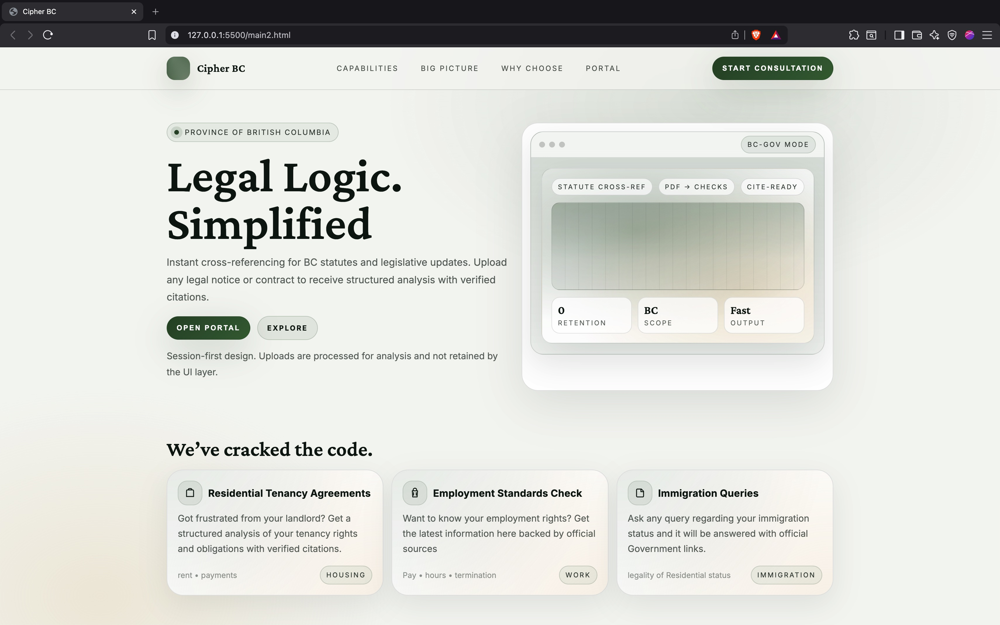
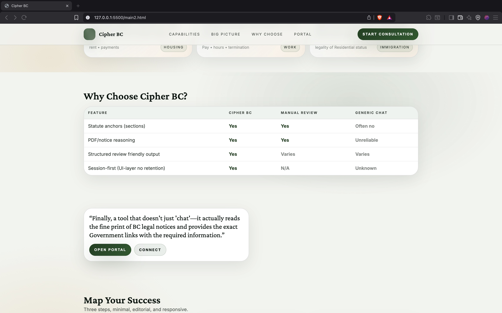
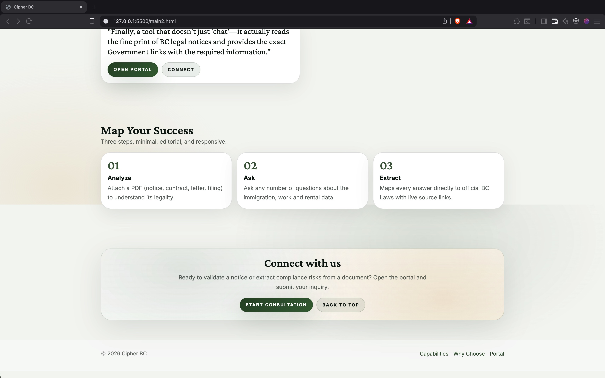
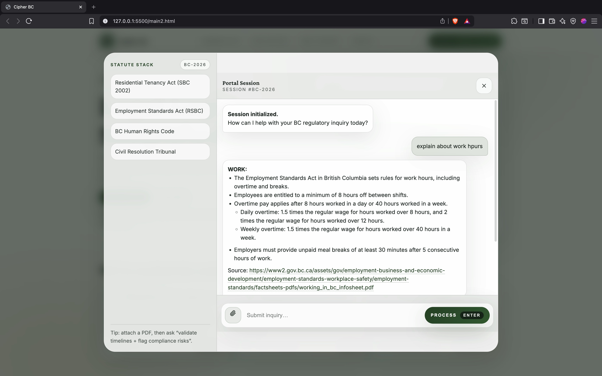

# Cipher BC — Regulatory Intelligence Portal

Ciphert BC is a web-based AI assistant built for **nwHacks 2026** that helps users query **British Columbia–specific legal and regulatory information**.  
It supports **natural language questions** and **PDF document uploads**, allowing users to ask questions directly about uploaded documents **without storing them**.

The system is designed around **ephemeral processing**: uploaded PDFs are read in memory, converted to text, passed to the LLM for reasoning, and immediately discarded.

---

## ✨ Features

### 🏛️ BC Legal Assistant
- Answers questions related to **Rent**, **Work**, and **Immigration** in British Columbia
- Automatically classifies user intent before responding
- Gracefully handles general questions and guidance

### 📄 PDF Upload & Document Q&A
- Upload a PDF and ask questions about it
- PDF text is extracted **in-memory only**
- No PDFs are saved to disk
- If no question is provided, the system automatically **summarizes the document**

### 💬 Interactive Chat Interface
- Clean, modern chat UI
- Supports:
  - Text-only queries
  - PDF + question
  - PDF-only uploads
- AI responses rendered with Markdown

### 🔐 Privacy & Safety
- Zero data retention
- No document storage
- No user tracking

---

## 🧠 Tech Stack

### Backend
- Python 3
- Flask
- Flask-CORS
- PyPDF (PDF text extraction)

### Frontend
- HTML
- CSS
- Vanilla JavaScript
- Fetch API + FormData
- Marked.js (Markdown rendering)

---

## 📁 Project Structure

```

nwHacks2026/
├── app.py              # Flask backend (API server)
├── bot.py              # Intent classification + LLM logic
├── read_pdf.py         # In-memory PDF text extraction
├── main2.html          # Frontend UI
├── requirements.txt    # Python dependencies
└── README.md           # Project documentation

````

---
## Demo






---

## ⚙️ Installation

### 1. Clone the repository
```bash
git clone https://github.com/TanyaAggarwal08/nwHacks2026.git
cd nwHacks2026
````

### 2. Clone the repository
```bash
Create a .env file
paste this
GITHUB_TOKEN=<Your-Github-Token-That-Can-Run-Models>
TAVILY_API_KEY=<Create-An-Account-With-Tavily-To-Get-Free-Key>
````

### 3. (Recommended) Create a virtual environment

```bash
python -m venv venv
source venv/bin/activate   # macOS / Linux
# venv\Scripts\activate    # Windows
```

### 4. Install dependencies

```bash
pip install -r requirements.txt
```

---

## ▶️ Running the Application

### Start the Flask backend

```bash
python app.py
```

Expected output:

```
Running on http://localhost:5000
```

### Open the frontend

You can either:

**Option 1: Open directly**

* Open `main2.html` in your browser

**Option 2: Serve locally**

```bash
python -m http.server 5500
```

Then visit:

```
http://127.0.0.1:5500/main2.html
```

---

## 💡 How to Use

### Text-only query

1. Open the chat
2. Type a question
3. Click **Process**

### PDF + question

1. Click the 📎 icon
2. Upload a PDF
3. Ask a question about the document
4. Click **Process**

### PDF only (no question)

1. Upload a PDF
2. Click **Process**
3. The document is automatically summarized

---

## 🧪 Example Queries

* “Is this eviction notice valid under BC tenancy law?”
* “Summarize this employment contract”
* “Can an international student work full time during the semester?”
* “Does this notice comply with BC rental regulations?”

---

## 🧩 How It Works (High-Level)

1. User submits a message and/or PDF
2. PDF text is extracted **in memory**
3. User intent is classified
4. LLM is prompted with:

   * The extracted document (if present)
   * The user’s question
5. Response is generated and returned
6. All document data is discarded

---

## 🧠 Architecture Note

This system performs in-context document reasoning rather than retrieval-augmented generation (RAG).  
Uploaded documents are passed directly to the language model in memory and are never chunked, embedded, or retrieved from storage.  
This design prioritizes privacy and simplicity. RAG-based retrieval may be added in future versions.

---

## ⚠️ Disclaimer

This project is intended for **educational and hackathon demonstration purposes only**.
It does **not** replace professional legal advice.

---

## 👥 Team

Built during **nwHacks 2026** by:

* **Ratna Koushik Appasani**
* **Tanya Aggarwal**

---

## 🚀 Future Improvements

* Citation highlighting inside uploaded PDFs
* Chunked retrieval for large documents
* Session-based document memory
* Deployment to cloud infrastructure
* Authentication & user sessions

---

## 📜 License

Open-source for educational and hackathon use.

```

